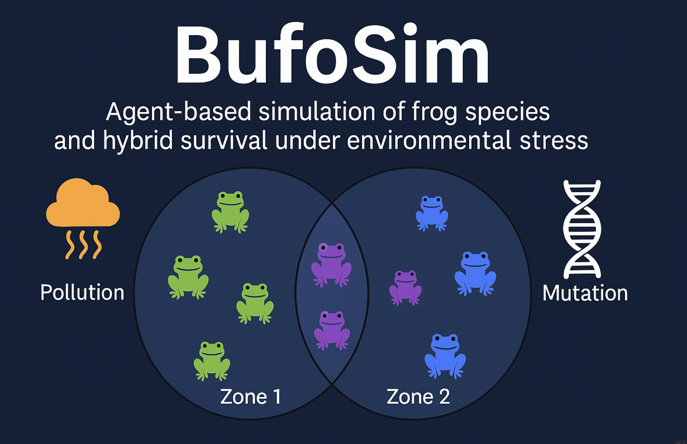

# BufoSim 🐸

  

 

**Author:** Altynay Aralbek
PhD Student in Biology · Akdeniz University · Biologist & Data Science Enthusiast

---

**BufoSim** is a spatial agent-based simulation of amphibian population dynamics under environmental stress. This project models the interaction of two frog species (A and B) and their hybrids (AB) across different habitat zones, incorporating factors such as pollution, food scarcity, mutations, migration, and hybridization.

---

## 📌 Features

- Spatial simulation using `GeoPandas` and `Matplotlib`
- Custom biological traits: `genetic_resistance`, `appetite`, `aggression`, `mobility`
- Mutation and generation tracking
- Natural hybridization logic
- Death conditions based on environmental pressure
- Visualization of population survival and zone distribution
- Animated `.gif` of population evolution

---

## 🔬 Parameters

| Parameter           | Range         | Description |
|---------------------|---------------|-------------|
| `genetic_resistance` | 0.4 – 1.0     | Resistance to pollution |
| `appetite`           | 0.2 – 0.8     | Food consumption level |
| `aggression`         | 0.1 – 0.6     | Not yet used (future use) |
| `mobility`           | 0.3 – 0.9     | Probability of migration |

---

## 🧪 Hypothesis Tested

**H1:** Hybrid frogs (AB) survive better under moderate pollution and food scarcity due to balanced traits.

**Result:** Confirmed. Hybrids had a 72.5% survival rate, while A and B had ~25–27%.

---

## 📂 Files

- `bufo_simulation.ipynb` — main simulation notebook
- `BufoSim_final_population.csv` — final dataset of frogs
- `bufo_evolution.gif` — animated evolution over time
- `requirements.txt` — list of required packages

---

## 🚀 How to Run

1. Open `bufo_simulation.ipynb` in Google Colab or Jupyter
2. Install dependencies:

   3. Run the notebook cells
4. Analyze results or generate new simulations
---

## 📄 License

This project is licensed under the MIT License.
